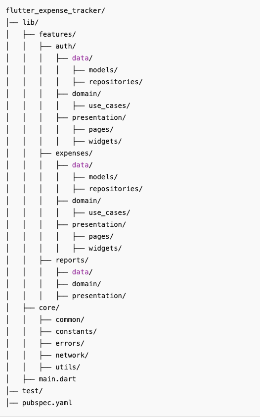

# Ứng dụng Theo dõi Chi tiêu Flutter

Ứng dụng Theo dõi Chi tiêu Flutter là một ứng dụng di động được xây dựng bằng Flutter, cho phép người dùng theo dõi chi tiêu và quản lý ngân sách một cách hiệu quả. Ứng dụng được thiết kế để mang lại trải nghiệm liền mạch và trực quan cho việc quản lý tài chính cá nhân.

## Tính năng

- Quản lý chi tiêu
- Chụp và Đọc Hóa Đơn (OCR)
- Lập ngân sách
- Phân tích & Báo cáo
- Chế độ tối: Chuyển đổi giữa giao diện sáng và tối để sử dụng dễ dàng hơn.

## Bắt đầu

### Yêu cầu

- Flutter SDK (phiên bản ổn định mới nhất)
- Android Studio hoặc Visual Studio Code
- Một thiết bị hoặc giả lập để kiểm tra

### Cài đặt

1. Clone repository:
   git clone https://github.com/ThuPham60232004/flutter_project_bdclpm.git
   cd flutter_expense_tracker
   
2. Cài đặt các thư viện phụ thuộc:
   flutter pub get

3. Chạy ứng dụng:
   flutter run

## Cấu trúc thư mục

## Công nghệ sử dụng

- Flutter: Khung ứng dụng di động đa nền tảng.
- Dart: Ngôn ngữ lập trình sử dụng với Flutter.

## Xử lý sự cố

### Các vấn đề thường gặp

- Lỗi: Gradle task assembleDebug failed with exit code 1:
  Chạy các lệnh sau:
  flutter clean
  flutter pub get
  flutter run

- Cảnh báo: SDK processing version mismatch:
  Đảm bảo rằng Android Studio và các công cụ dòng lệnh đã được cập nhật.

## Đóng góp

Rất hoan nghênh sự đóng góp! Vui lòng làm theo các bước sau:

1. Fork repository.
2. Tạo một nhánh mới (`git checkout -b feature/your-feature-name`).
3. Commit thay đổi của bạn (`git commit -m 'Thêm tính năng mới'`).
4. Đẩy lên nhánh (`git push origin feature/your-feature-name`).
5. Tạo một pull request.

## Giấy phép

Dự án này được cấp phép theo giấy phép MIT - xem tệp [LICENSE](LICENSE) để biết thêm chi tiết.

## Liên hệ

Mọi thắc mắc xin liên hệ:
- Tên: Thu Phạm
- Email: phamthianhthu6023789@gmail.com

---

Chúc bạn quản lý chi tiêu hiệu quả với Ứng dụng Theo dõi Chi tiêu Flutter!

